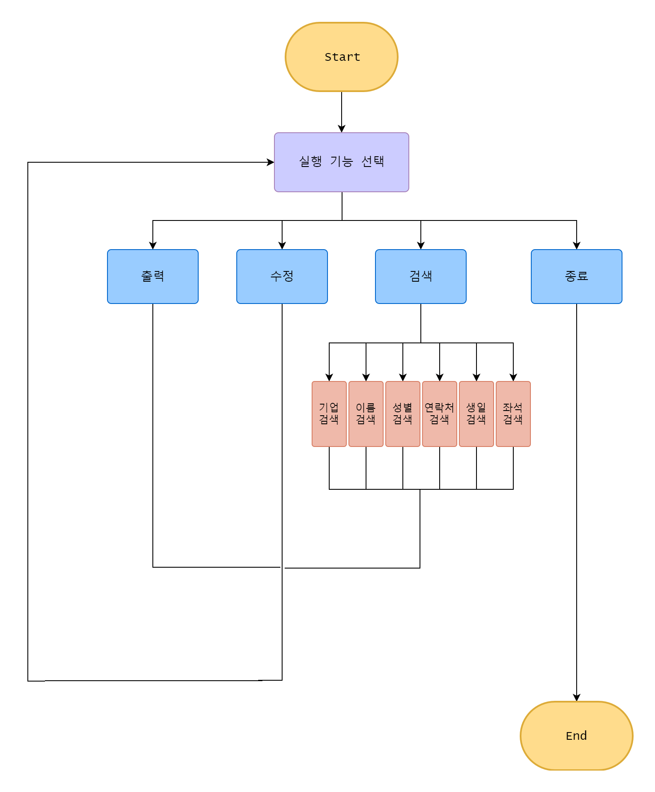
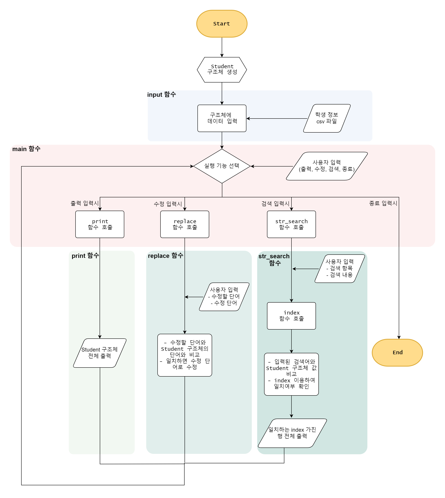
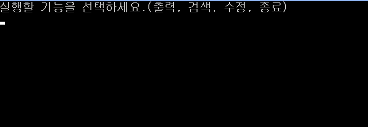
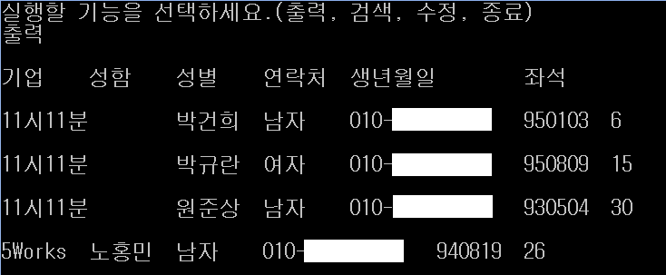
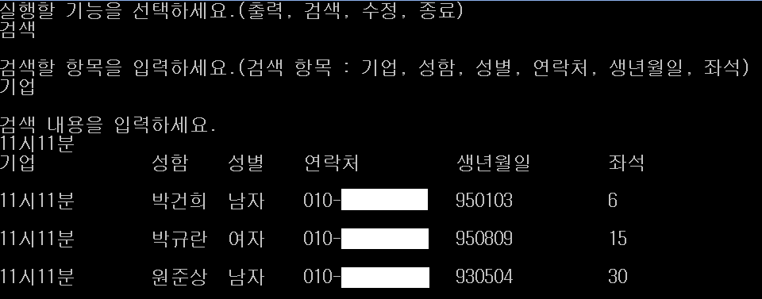
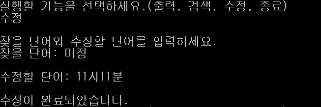
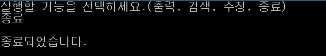

<h2>학생 정보관리 프로젝트</h2>

--- 

<h3> 1. 프로젝트 목적 </h3>

학생정보 파일을 기반으로 학생 정보를 검색하여 해당 학생의 정보를 출력

- csv파일 읽기 -  구조체 형태로 저장 - 데이터 검색 - 결과 출력  
  
  <h3>  </h3>  

<h3> 2. 입력 데이터 형태</h3>

|  기업(company)  | 이름(name) | 성별(sex) | 연락처(phone) | 생년월일(birth) | 좌석(seats) |
| :-------------: | :--------: | :-------: | :-----------: | :-------------: | :---------: |
|     5Works      |    김**    |   여자    | 010-0000-0000 |   1900-00-00    |      1      |
|     5Works      |    박**    |   남자    | 010-0000-0000 |   1900-00-00    |      2      |
|   모코엠시스    |    이**    |   여자    | 010-0000-0000 |   1900-00-00    |      3      |
| 메가존 클라우드 |    최**    |   남자    | 010-0000-0000 |   1900-00-00    |      4      |

  
    <h3>  </h3>  
<h3> 3. 구조 설계 </h3>
  
<b>1) 기능</b>

- student.h: 구조체 선언
- project.cpp: 실행 기능 선택, 함수 호출
  
- main
  
- function.cpp: 함수 선언

  - input
  - index
  - print
  - str_search
  - replace
  
    

<b> 2) 함수 설명</b>

- main: 실행할 기능 선택하는 함수
  - scanf로 사용자에게 입력받아 실행 기능 선택(출력, 검색, 수정, 종료)
  - strcmp 이용하여 해당 기능 함수 호출

- input: csv 파일을 읽어들여 구조체에 저장하는 함수

  - fopen 이용하여 csv file 열기

  - fgets, sscanf 이용하여 csv파일의 한 줄씩 구조체에 입력

- index: str_search 함수에서 일치 여부를 확인하기 위한 함수
  - 1차원 문자열 배열, 2차원 문자열 배열 입력받기
  - strcmp 이용하여 일치하면 해당 index를 포인터로 반환

- print:  출력 함수

  - printf 이용하여 구조체 값 출력

- str_search: 검색 함수

  - scanf 이용하여 검색 항목, 검색 내용 사용자에게 입력받기
  - strcpy 이용하여 구조체에 항목 입력
  - 검색 항목이 일치하는 경우, index 함수를 이용하여 Student 구조체와 검색 내용을 비교하고 일치하면 행번호(idx) 반환
  - 해당 행번호(idx)를 Student 구조체에서 찾아 출력

- replace: 수정 함수

  - scanf 이용하여 찾을 단어, 수정할 단어 사용자에게 입력받기
  - strcmp, strcpy 이용하여 해당 값 수정
  
    

<b> 3) 구조 설계</b>

- 사용자 순서도

  

- 개발자 순서도

    <h3>  </h3>  
<h3> 4. 작동 화면 </h3>

<b>1) 시작 화면</b>

<b>2) 출력</b>

<b>3) 검색</b>

<b>4) 수정</b>

<b>5) 종료</b>

  
    <h3>  </h3>  

<h3> 5. 개발 환경</h3>

- Language: C 

- IDE: Visual Studio 2017

    <h3>  </h3>  
  
<h3> 6. 팀원 </h3>

- 정종찬(팀장): 데이터 입출력, 구조체  생성, 전체 코드 수정
- 이상아(팀원): 데이터 전처리, 수정 기능
- 고기륜(팀원): 검색 기능

