# 1. GAN 기본


### -Vanilla GAN

#### - AI

- Computer Vision (시각 지능)	
  - 인식
  - 생성(GAN)
- 자연어 처리
- Data Science


---

### 1) GAN의 기본 원리

> "나의 행운은 적의 불행이요, 나의 불행은 적의 행운이다."


- 배경 1: Adversarial search(적대적 탐색)

  - 게임 이론의 알고리즘

  - 서로 반대되는 입장의 두 player가 서로 입장을 바꾸어 가면서 play함으로써 최적의 해 탐색하는 과정

    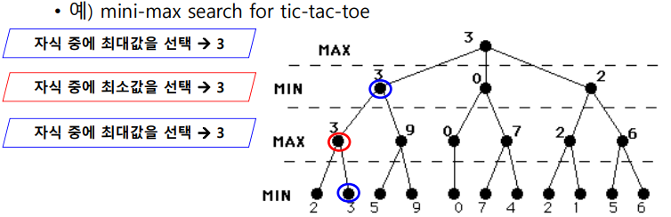
    
    
    
    <br>

- 배경 2: 심층 학습의 discriminative model이 중점적으로 발전해 옴
  - discriminative model
    - 입력 데이터를 미리 정의한 카테고리로 분류
    - 입력: 복잡한 모델(영상 등)
    - 출력(predicted probability): scalar값
  
  <br>

- 배경 3: 심층 학습에서 generative model에 대한 개념이 떠오름

  - Generative model

    - 간단한 정보로부터 복잡한 모델 합성하는 도구
    - 입력: 간단한 정보(latent vector)
    - 출력: 비교적 정교하고 사실적인 영상

    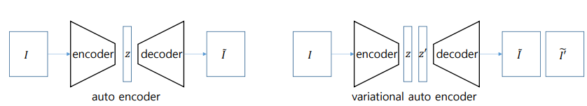

    
    
    - I: 원본(RAW 파일 등) -> 크기가 크다!
    - encoder로 압축하여 반환 
    - 눈으로 보기에는 입력 I와 출력 I' 차이 없음


---

### 2) GAN의 개념

> "나는 강해진다, 나의 적이 강한 만큼"


- 생성자(Generator)와 판별자(Discriminator)의 대립과 경쟁을 통해 모델 훈련 

- 생성자(G)
  - 가짜 이미지 생성
  - 대립을 통해 더 우수한 품질의 결과를 도출하도록 훈련

- 판별자(D)
  - 진짜/가짜 이미지 판별
  - 생성자의 결과가 만족할 수준인지를 판별하여 fake/real 결과를 도출

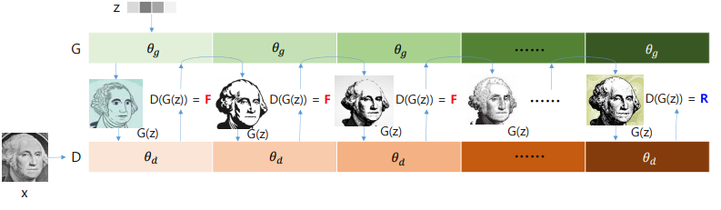

<br>

- [얼굴 이미지 생성 사이트](https://thispersondoesnotexist.com/): 더 실제같은 얼굴을 만들기 위해 노력


---

### 3) GAN의 구성 요소

####  (1) 생성자(Generator)

- Decoder와 유사한 구조

- 입력(latent vector)을 받아 결과(synthesized image)를 생성하는 모듈

- vanila GAN에서는 convolution 사용 X

  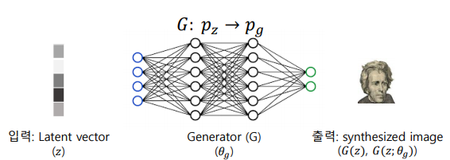

  

- Generator의 구조

  - n개의 generator block으로 구성
  - generator block: 낮은 해상도의 입력 -> 높은 해상도의 출력 생성

  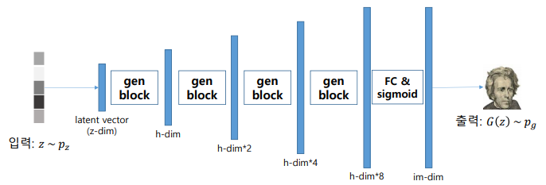


#### (2) 판별자(Discriminator)

- 입력(real data, fake data)을 받아 real/ fake를 판별

- Classifier과 유사한 역할 수행

  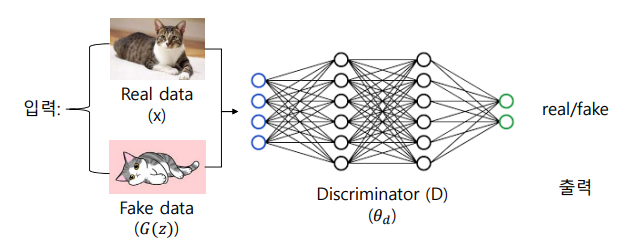

- Discriminator의 구조

  - n개의 discriminator block으로 구성
  - 높은 해상도의 입력을 받아 낮은 해상도의 출력을 생성

  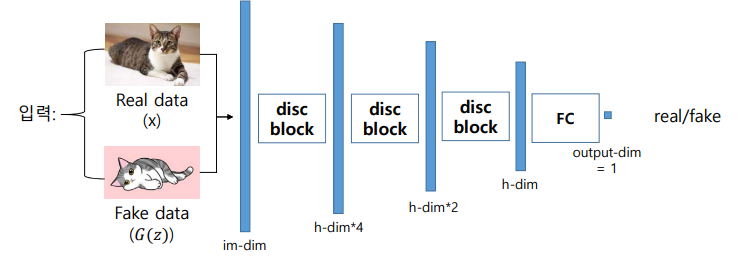

#### (3) loss 함수

- loss함수는 BCE에서 도출된다. 

  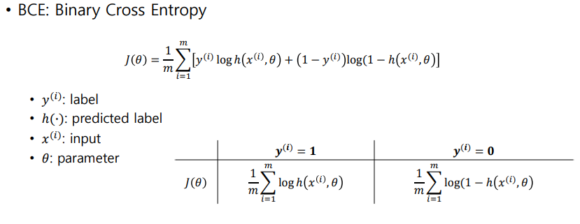


---

### 4) 학습

- GAN의 훈련 목표
  - 진짜 같은 이미지 생성
  - 훈련 데이터 x와 일치하는 G(z)를 생성하는 것

- GAN 훈련의 어려움
  - D와 G를 동시에 훈련해야 한다. (D는 max, G는 min을 추구)
  
- GAN의 heuristic한 훈련 전략
  - 초기에는 log(1-D(G(z)))를 사용하지 않고 D(G(z))를 최대화하는 방향으로 훈련
  - D(G(z))는 log(1-D(G(z)))보다 값이 크기 때문에 gradient 소실 문제를 피할 수 있음

- GAN 훈련 과정

  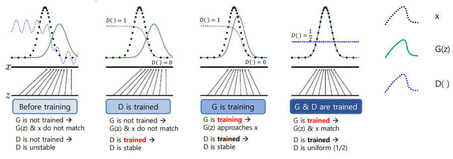
  
  <br>

----

## [실습 - GAN 구현]

- 이용 데이터: MNIST

  

>### 모델 구현 순서
>
>1) Generator
>
>2) Discriminator 
>
>3) 초기화
>
>4) Loss 함수
>
>5) Training 


### 1) Generator

- Generator block

  - Linear, BatchNorm, ReLU 함수로 구성

  ```python
  def gen_block(input_dim, output_dim):
      return nn.Sequential(
          nn.Linear(input_dim, output_dim),
          nn.BatchNorm1d(output_dim),
          nn.ReLU(inplace=True)
      )
  ```

  

- Generator의 구조

  - 4개의 generator block과 FC Layer, sigmoid 함수로 구성
  - MNIST 데이터 입력(28x28)
    - 입력: z_dim = 10
    - 출력: im_dim = 784

  ```python
  class Generator(nn.Module):
      def __init__(self, z_dim=10, im_dim=784, hidden_dim=128):
          super(Generator, self).__init__()
          self.gen = nn.Sequential(
              gen_block(z_dim, hidden_dim),
              gen_block(hidden_dim, hidden_dim * 2),
              gen_block(hidden_dim * 2, hidden_dim * 4),
              gen_block(hidden_dim * 4, hidden_dim * 8),
  
              nn.Linear(hidden_dim * 8, im_dim),
              nn.Sigmoid()
          )
  
      def forward(self, noise):
          return self.gen(noise)
      
      def get_gen(self):
          return self.gen
  ```

  

<br>

### 2) Discriminator

- Discriminator block

  - Linear, ReLU 함수로 구성

  ```python
  def dis_block(input_dim, output_dim):
      return nn.Sequential(
          nn.Linear(input_dim, output_dim),
          nn.LeakyReLU(0.2, inplace=True)
      )
  ```

  

- Discriminator의 구조

  - 3개의 discriminator block과 FC Layer로 구성
  - MNIST 데이터 입력(28x28)
    - 입력: im_dim = 784
    - 출력: 1

  ```python
  class Discriminator(nn.Module):
      def __init__(self, im_dim=784, hidden_dim=128):
          super(Discriminator, self).__init__()
          self.disc = nn.Sequential(
              dis_block(im_dim, hidden_dim * 4),
              dis_block(hidden_dim * 4, hidden_dim * 2),
              dis_block(hidden_dim * 2, hidden_dim),
              nn.Linear(hidden_dim, 1)
          )
  
      def forward(self, image):
          return self.disc(image)
  
      def get_disc(self):
          return self.disc
  ```

  <br>

### 3) 학습 결과

- 원본 이미지

  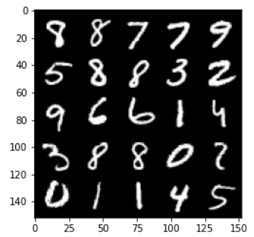

- 학습 초기 생성 이미지

  - step 2000

  - Generator loss: 1.7751099584102639

  - discriminator loss:0.19727708819508571

    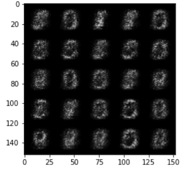

- 40,000 step 학습 이후 이미지

  - step 40000
  - Generator loss: 2.2366061971187583
  - discriminator loss:0.30851581758260765

  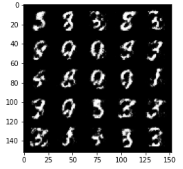

