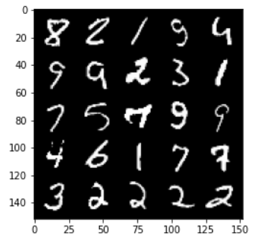

# 2. GAN의 발전 -  (1) DCGAN

> 2.1 DCGAN의 기본 원리 
>
> 2.2 DCGAN의 개념 
>
> 2.3 DCGAN의 구성 요소 (1): generator 
>
> 2.4 DCGAN의 구성 요소 (2): discriminator 
>
> 2.5 DCGAN의 구성 요소 (3): loss 함수 
>
> 2.6 DCGAN의 구성 요소 (4): 훈련 
>
> 2.7 DCGAN의 구현


---

### - Vanilla GAN의 문제점 및 해결

- 이미지 생성의 성능이 만족스럽지 않음 -> DCGAN
- 학습의 불안정성 -> WGAN with Gradient Penalty
- 통제 불가능한 결과 -> CGAN


---

### 1) DCGAN의 기본 원리: Convolution 연산


#### - Convolution (합성곱)

- 주어진 함수에 g(kernel, filter)를 곱해서 더하는 연산


- **Convolution의 주요 속성**
  - `size`(kernel의 크기): 3x3, 4x4, 5x5, ...
  - `stride`(kernel의 적용 단위): 1, 2, 3, ...
  - `padding`(입력 영상의 주변): None, 0, 1, ...


- pytorch에서의 conv 연산

  ```python
  torch.nn.Conv2d(in_channels, out_channels, kernel_size, stride=1, padding=0,
                  dilation=1, groups=1, bias=True, padding_mode='zeros')
  ```

  - Conv2d(1, 5, 5)

  

  - Conv2d(3, 10, 5, 1, 2)

  

​		


#### - Transposed Convolution 연산


---

### 2) DCGAN의 개념

- Deep Convolutional GAN
  - 향상된 이미지 생성
  - 비지도학습에 우수한 후보
  -  latent space(generator의 input공간)에서 부드러운 변화
  - Vanilla GAN에서는 Convolution layer 사용 X

<br>

---

### 3) DCGAN의 구성 요소

#### (1) Generator

- generator의 구조

  

- gen block

  - parameter: input_channels, output_channels, kernel, stride, final_layer 
  - components for internal 
    - transposed convolution + batch norm + ReLU
  - components for final 
    - Transposed convolution + tanh

  

<br>

#### (2) Discriminator

- disc block 
  - parameter: input_channels, output_channels, kernel, stride, final_layer) 
  - components for internal 
    - convolution + batch norm + LeakyReLU (0.2) 
  - components for final 
    - convolution


---

## [실습 - DCGAN 구현]

- 이용 데이터: MNIST

---

> ### 모델 구현 순서
>
> 1. Generator
> 2. Discriminator
> 3. 초기화
> 4. loss 함수
> 5. training

---

### 1) Generator

- Generator block
  - Convolution, BatchNorm, ReLU 함수로 구성
  - kernel_size = 3, stride = 2
- Generator의 구조
  - 4개의 generator block으로 구성
  - MNIST 데이터 입력(28x28)
    - 입력: z_dim = 10
    - 출력: in_chan = 1

```python
class Generator(nn.Module):
  def __init__(self, z_dim=10, in_chan=1, hidden_dim=64):
    super(Generator, self).__init__()
    self.z_dim = z_dim
    # Build the neural network
    self.gen = nn.Sequential(
        self.gen_block(z_dim, hidden_dim * 4),
        self.gen_block(hidden_dim * 4, hidden_dim * 2, kernel_size=4, stride=1),
        self.gen_block(hidden_dim * 2, hidden_dim),
        self.gen_block(hidden_dim, in_chan, kernel_size=4, final_layer=True),
    )

  # generator block
  def gen_block(self, in_channel, out_channel, kernel_size=3, stride=2, final_layer=False):
    if not final_layer:
      return nn.Sequential(
          nn.ConvTranspose2d(in_channel, out_channel, kernel_size=kernel_size, stride=stride),
          nn.BatchNorm2d(out_channel),
          nn.ReLU(inplace=True),
      )
    else:
      return nn.Sequential(
          nn.ConvTranspose2d(in_channel, out_channel, kernel_size, stride),
          nn.Tanh(), # tanh => -1 ~ 1까지 나오므로 값을 제한하기 위해 사용함
      )
```

<br>

### 2) Discriminator

- Discriminator block
  - Convolution, BatchNorm, ReLU 함수로 구성
- Discriminator의 구조
  - 3개의 Discriminator block으로 구성

```python
class Discriminator(nn.Module):
    def __init__(self, im_chan = 1, hidden_dim = 16):
        super(Discriminator, self).__init__()
        self.disc = nn.Sequential(
            self.disc_block(im_chan, hidden_dim),
            self.disc_block(hidden_dim, hidden_dim * 2),
            self.disc_block(hidden_dim * 2, 1, final_layer = True),
        )
        
    # def disc_block
    def disc_block(self, in_channel, out_channel, kernel_size = 4, stride = 2, final_layer = False):
        if not final_layer:
            return nn.Sequential(
                nn.Conv2d(in_channel, out_channel, kernel_size, stride),
                nn.BatchNorm2d(out_channel),  # output_channels
                nn.LeakyReLU(0.2, inplace = True)
            )
        else: # Final Layer
            return nn.Sequential(
                nn.Conv2d(in_channel, out_channel, kernel_size, stride)
            )
```

<br>


### 3) 학습 결과

- 원본 이미지 



- 학습 초기 생성 이미지
  - Step 1500
  - Generator loss: 2.058071608543397
  - Discriminator loss: 0.2916698960810899


- 10,000 step 학습 이후 생성 이미지
  - Step 10000
  - Generator loss: 0.7489798386693001
  - Discriminator loss: 0.6860970276594157


