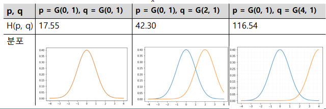
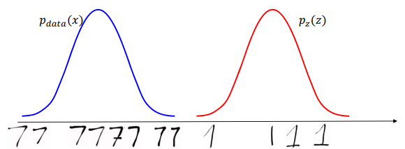
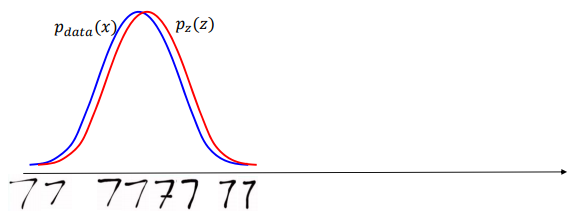
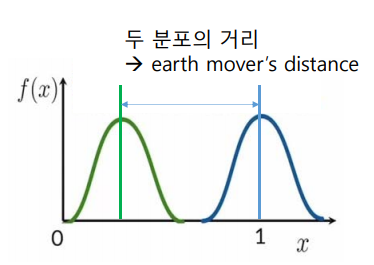
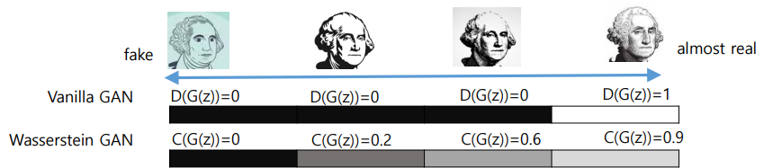
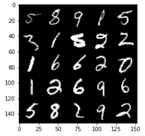
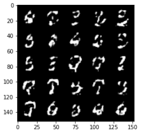
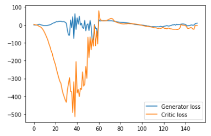

# 3. GAN의 발전 - (2) WGAN

>3.1 WGAN의 기본 원리 
>
>3.2 WGAN의 개념 
>
>3.3 WGAN의 구성 요소 (1): generator 
>
>3.4 WGAN의 구성 요소 (2): discriminator 
>
>3.5 WGAN의 구성 요소 (3): Gradient Penalty 
>
>3.6 WGAN의 구성 요소 (3): loss 함수 
>
>3.7 WGAN의 구성 요소 (4): 훈련 
>
>3.8 WGAN의 구현

---


### 1) WGAN의 기본 원리: Entropy

#### - Entropy의 개념

- `m`: 정보를 포함하는 message
- `p(m)`: m의 확률
- `I(m)`: m에 대한 self-information

$$
I(m) = log(\frac{1}{p(m)}) = - log(p(m))
$$

- 메시지 `m`의 집합 M에 대한 정보량의 평균값
  $$
  \sum p(m)*I(m)
  $$

  - 예)
    - M = (0, 1) with p(0) = 0.001, p(1) = 0.999 (최소) 
      - H(M) = -(0.001\*log(0.001) + 0.999*log(0.999))  ≈ 0.011
    - M = (0, 1) with p(0) = 0.5, p(1) = 0.5 (최대) 
      - H(M) = -(0.5\*log0.5 + 0.5*log0.5) = 1
    - M = (0, 1) with p(0) = 0.25, p(1) = 0.75 
      - H(M) = -(0.25\*log0.25 + 0.75*log0.75) = 0.811


- Cross entropy

  - 두 확률 분포 p와 q에 대해서 q를 이용하여 p를 설명할 때 필요한 정보량

  $$
  H(p, q) = E_p [-log(q)] = - \sum_x p(x)log{ q(x)}
  $$

  - 예)	

    - p = Gaussian(0.0, 1.0) & q = Gaussian(0.0, 1.0) 
      - 확률 분포 p와 q가 일치 -> 최소의 정보량만 요구함 
    - p = Gaussian(0.0, 1.0) & q = Gaussian(8.0, 1.0)
      - 확률 분포 p와 q가 거의 일치하지 않음 -> 최대의 정보량을 요구

    

    

---

### 2) WGAN의 개념

#### (1) GAN의 목적

- p(x)와 최대한 비슷한 p(z)를 만들자

- p(x)와 p(z)의 거리를 최소로 만들자





<br>

#### (2) Wasserstein Distance

- Cross entropy를 이용한 distribution의 거리 측정의 문제점
  - gradient vanishing 문제

- 해결책: Earth Mover's Distance

  - 두 분포의 차이를 두 분포 사이의 거리로 정의
  - 한 분포를 다른 분포로 옮기는 작업을 earth move로 간주

  

- Wasserstein distance

  - Earth mover's distance를 이용하여 정의

  - Discriminator -> Critic

    - Discriminator는 Fake의 경우 0, Real의 경우 1
    - Critic은 (0,1) 사이의 점수를 return한다.

    


#### (3) Gradient penalty 설계

- Lipschitz 연속 함수

  - 두 점 사이의 거리가 일정한 비율 이상으로 증가하지 않는 함수

- 1-Lipschitz 연속 함수 (1-L 연속)

  - K = 1인 함수

  - Gradient vanishing을 피하기 위한 조건으로 사용

    

---

## [실습 - WGAN 구현]

- 이용 데이터: MNIST

---

> ### 모델 구현 순서
>
> 1. Generator
> 2. Critic
> 3. 초기화
> 4. Gradient penalty
> 5. Loss 함수
> 6. Training

---

### 1) Generator

- Generator block
  - Convolution, BatchNorm, ReLU 함수로 구성
  - kernel_size = 3, stride = 2
- Generator의 구조
  - 4개의 generator block으로 구성
  - MNIST 데이터 입력(28x28)
    - 입력: z_dim = 10
    - 출력: in_chan = 1

```python
class Generator(nn.Module):
    def __init__(self, z_dim=10, im_chan=1, hidden_dim=64):
        super(Generator, self).__init__()
        self.z_dim = z_dim

        # Build the neural network
        self.gen = nn.Sequential(
            self.gen_block(z_dim, hidden_dim * 4),
            self.gen_block(hidden_dim * 4, hidden_dim * 2, kernel_size=4, stride=1),
            self.gen_block(hidden_dim * 2, hidden_dim),
            self.gen_block(hidden_dim, im_chan, kernel_size=4, final_layer=True),
        )

    def gen_block(self, input_channels, output_channels, kernel_size=3, stride=2, final_layer=False):
        if not final_layer:
            return nn.Sequential(
                nn.ConvTranspose2d(input_channels, output_channels, kernel_size, stride),
                nn.BatchNorm2d(output_channels),
                nn.ReLU(inplace = True),
            )
        else:
            return nn.Sequential(
                nn.ConvTranspose2d(input_channels, output_channels, kernel_size, stride),
                nn.Tanh(),
            )
```

<br>

### 2) Critic

- Critic block
  - Conv, BatchNorm, LeakyReLU로 구성
  - kernel_size = 4, stride = 2

- Critic의 구조
  - 3개의 critic block으로 구성

```python
class Critic(nn.Module):
    def __init__(self, im_chan = 1, hidden_dim = 64):
        super(Critic, self).__init__()
        self.crit = nn.Sequential(
            self.crit_block(im_chan, hidden_dim),
            self.crit_block(hidden_dim, hidden_dim * 2),
            self.crit_block(hidden_dim * 2, 1, final_layer = True),
        )

    def crit_block(self, input_channels, output_channels, kernel_size = 4, stride = 2, final_layer = False):
        if not final_layer:
            return nn.Sequential(
                nn.Conv2d(input_channels, output_channels, kernel_size, stride),
                nn.BatchNorm2d(output_channels),
                nn.LeakyReLU(0.2, inplace = True)
            )
        else: # Final Layer
            return nn.Sequential(
                nn.Conv2d(input_channels, output_channels, kernel_size, stride)
            )
```

<br>

### 3) Gradient penalty

```python
def gradient_penalty(gradient):
    # Flatten the gradients so that each row captures one image
    gradient = gradient.view(len(gradient), -1)

    # Calculate the magnitude of every row
    gradient_norm = gradient.norm(2, dim=1)

    # Fenalize the mean squared distance of the gradient norms from 1
    penalty = torch.mean((gradient_norm - 1)**2)
    return penalty
```

<br>

### 4) 학습 결과

- 원본 이미지



- 학습 이미지
  - step: 3,000
  - Generator loss: 2.82485
  - Critic loss: -14.99197



- 학습 그래프




