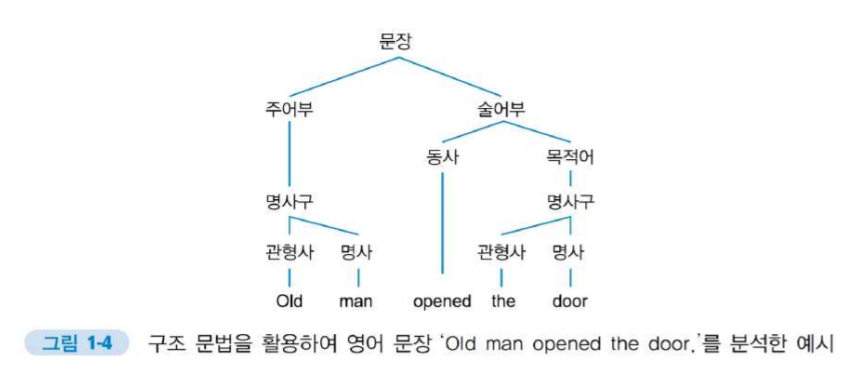

# 1. 자연어처리 소개

### 1) 자연어처리 소개

#### - 자연어처리란?

- **자연어(Natural Language)**
  - 사람들의 사회생활에서 자연스럽게 발생하여 쓰이는 언어
  - 컴퓨터에게 명령을 하기 위해 정제한 단어들과 반대되는 의미로 쓰임

- **자연어 처리(Natural Language Process, NLP)**

  - 자연어를 그대로 컴퓨터로 처리하는 학문 분야

  - 언어학적 측면: 언어의 규칙성이나 변화 양상 등을 파악

  - 전산학적 측면: 자연어를 입출력으로 사용하는 컴퓨터 프로그램에 사용되는 처리과정

    

  - 자연어 이해(Natural Language Understanding, **NLU**): 사람이 이해하는 자연어를 컴퓨터가 이해할 수 있는 값으로 바꾸는 과정

  - 자연어 생성(Natural Language Generation, **NLG**): 컴퓨터가 이해할 수 있는 값을 사람이 이해하도록 바꾸는 과정 

#### - 자연어처리의 응용 분야

- 언어학적인 활용: 전산 언어학에서 언어 분석에 사용
- 전산학적인 활용: 기계번역, 음성인식, 개인비서 서비스, 날씨정보 요약, 인공지능 서비스 등

- 자연어처리의 연구 분야

  

---

### 2) 자연어처리가 어려운 이유 5가지

#### (1) 언어의 중의성(Ambiguity)

- '배'라는 단어의 해석
  - 과일의 한 종류
  - 운송 수단
  - 크기 비교의 단위
- 영어의 'read', 한자의 '行' 또한 두 개 이상의 의미를 찾을 수 있음
  - read는 뜻에 따라 발음도 다름
- 상황에 따라 여러 의미를 내포
  - 비꼬는 의미의 '참 잘 했다.'
- 완벽히 같은 글자의 조합도 여러 의미를 가짐

 

#### (2) 규칙의 예외

- 형태론: 언어의 규칙을 연구하는 분야
  - 학문 분야로 자리잡을 정도로 규칙이 어렵고 복잡함
- 언어 규칙의 예
  - -ed: 과거형
  - '보슬비'의 '보슬': '바람없이 조용히 내리는'
- 숙어로 쓰인 동사나 명사는 원본 단어의 규칙을 그대로 적용할 수 없음
  - "Hit the sack": 잠들다
  - "Hit the brown sack": 갈색 자루를 때리다
- 규칙을 모든 단어에 그대로 적용할 수 없음 -> 처리의 복잡도 상승

 

#### (3) 언어의 확장성과 유연성

- **언어의 확장성**
  - 언어는 무한하다.

    - 단어와 소리의 개수는 유한하지만, 이를 조합하여 만들 수 있는 문장의 수/길이가 무한함

  - 구조 문법을 사용한 확장성의 이해

    - 문장의 여러 단어가 이루는 구조를 통해 문장이 구성된다는 문법 모델

    - 중의성을 완전히 해결할 수는 없지만, 언어의 확장성을 설명할 수 있음
      

  - 단어 자리에 구를 넣어 문장 길이를 계속 늘릴 수 있음

    - man -> old man
    - party -> party that she woud also attend

     

- **언어의 유연성**

  - 언어는 항상 변하며, 시대가 지나 더 이상 쓰이지 않는 단어도 있고, 새롭게 탄생한 용어도 있다. 
  - 언어가 태어나는 방법도 다양
  - 이 모든 방법들을 규칙화 할 수 없다.

 

#### (4) 바꾸어 말하기(Paraphrase)

- 사진 묘사 
  - 남자가 기타를 치고 있다. 
  - 남자가 기타를 친다. 
  - 남자가 기타 연주를 하고 있다. 
  - 남자가 앉아서 기타를 연주한다. 
  - 어떤 남자가 기타를 이용하여 음악을 연주한다.
- 문장의 표현 형식은 다양하고, 비슷한 의미의 단어들이 존재하기 때문에 paraphrase 문제가 존재함

 

#### (5) 단어 간 유사도 측정

- 이산적인 값을 갖는 자연어는 사람 입장에서는 인지하기 쉬울 수 있지만, 기계 입장에서는 매우 어려운 값

- One-hot 인코딩으로 표현된 값은 유사도나 모호성을 표현하지 못한다.
  - 서로 다른 one-hot 벡터끼리 유사도 및 거리는 모두 동일
  - 예) '파란색'과 '하늘색' 중 '녹색'에 가까운 단어는?
  - 사람의 언어 체계는 계층적 구조를 가짐
- 높은 차원으로 표현되어 sparse vector가 됨
- 딥러닝에서는 단어 임베딩을 통해 해결
  - word embedding
    - 단어 간의 유사도
    - 빨간색 - 하늘색간의 거리가 하늘색-파란색의 거리보다 멀게 하고 싶다. 

 

---

### 3) 한국어 자연어처리가 어려운 이유

#### (1) 교착어

- **교착어의 정의 **
  - 어근과 접사에 의해 단어의 기능이 결정되는 언어의 형태

  - 형태론적 관점의 언어 분류

    

- **교착어(접사 추가에 따른 의미 파생)**

  

- **교착어(유연한 단어 순서 규칙)**

  - 단어의 순서에 의한 다양한 변형 - "나는 밥을 먹으러 간다."

    

 

#### (2)  모호한 띄어쓰기

- 근대 이전까지 동양권 언어에서는 띄어쓰기가 존재하지 않음 
  - 중세시대 서양에서는 띄어쓰기 확립됨 
- 우리말은 아직 띄어쓰기 정착 단계 
  - 「전 국립언어원장의 고백 “띄어쓰기, 나도 자신 없다“ 」 
- 띄어쓰기는 어느 정도 틀려도 의사소통에 문제가 없기 때문

 

#### (3) 평서문과 의문문의 차이 부재 & 주어 부재

 

#### (4) 한자 기반의 언어 & 단어 중의성

- 한자 기반의 언어 
  - 한자(표의 문자) à 한글(표음 문자) 로 감싸 안음(wrapping) 
    - 표의 문자: 의미 또는 사물의 형상을 글씨로 표현 
    - 표음 문자: 사람이 말하는 음성, 소리를 글씨로 표현 
  - 감싸는 과정에서 정보의 손실 발생 
    - 茶 vs. 車 
- 단어의 중의성에 의한 문제 
  - – ‘차’ 

 

---

### 4) 자연어처리 연구의 패러다임

#### (1) 규칙 기반

- 언어의 문법적 규칙을 사전에 정의하고 이에 기반하여 자연어를 처리
- 초창기의 자연어처리 연구에 많이 사용됨 
  - 1954년: 영어-러시아어 번역기 (IBM, 조지타운대학) 
  - 1960년: 대화형 시스템(SHRDLU ELIZA) 
- 규칙 기반 자연어처리 예시 
  - 기계 번역: 형태소 등의 단위로 문장을 분해하고, 그 사이에서 찾아낸 규칙을 사용하여 번역 
  - 명령 인식: 목적어와 동사 등이 문장에서 위치하는 규칙을 이용하여 대상과 행동 등을 이해 
- 뚜렷한 한계가 존재하여 더 이상 사용되지 않음 
  - 어순이 정형화되어 있지 않은 언어라면(한국어), 분석에 한계가 있음 
  - 규칙을 미리 지정하는 것이 큰 부담
  - 규칙을 적용할 단위로 분해하는 작업의 정확도가 낮음

 

#### (2) 통계 기반

- 규칙 사전 정의를 통계적으로 처리 – 어떤 규칙이 언어에 있다면 어구나 단어 사이에 통계적으로 유의미한 값이 도출된다고 가정 
- 컴퓨터 성능이 발전하여 대량 데이터를 빨리 처리할 수 있게 되면서 발전함 
  - 통계적 분석을 위해서는 사전에 수집된 대량의 문장들을(코퍼스) 처리해야 함 

- 조건부 확률이라는 수학 개념이 가장 핵심 
  - 어떤 사건이 이미 일어난 것을 가정하고, 그 상황에서 다른 사건이 일어날 확률 
  - 어떤 단어가 나타날 확률을 앞뒤의 단어(들)을 기반으로 계산하는 것

- 통계 기반 분석의 한계 
  - 복잡한 규칙을 처리하기 어려움 
  - 여전히 사람 손이 많이 가는 통계 분석 자료를 활용함

 

#### (3) 딥러닝 기반

- 알고리즘(Algorithm) 
  - (일반적인) 알고리즘: 어떤 상황에서 어떻게 어떤 값을 계산해야 하는 지를 사전에 지정한 연산의 흐름
  - 어떤 데이터가 들어올 지 예측이 가능해야 하고, 개발자 역시 그 처리 법을 명확히 알고 있어야 함 (explicit) 
- 기계 학습(Machine learning) 
  - 입력으로 들어올 데이터를 대입하여 알고리즘이 스스로 연산의 가중치 를 학습하게 함
  - 프로그램 작성 후 바로 사용하지 않고 학습하는 과정이 필요 (train & inference) 
  - 학습 완료된 가중치는 저장 후 나중에 다시 활용 가능
- 신경망(Neural network) 
  - 기계 학습 종류의 일종으로 신경계 구성 형태를 모티브로 만든 구조 
  - 여러 입력에 가중치를 곱하여 합하고, 활성 함수에 통과한 후 전달 
  - 입력, 출력을 제외한 층을 은닉층이라 함

- 딥러닝 – 신경망 구조의 은닉층 수를 매우 많이 추가한 것 
  - 은닉층 개수에 대한 정해진 기준은 없지만, 연산의 가중치나 흐름이 무엇을 의미하는지 개발자조차 알 수 없음 
  - 하지만 여러 복잡한 특징을 처리하게 되어 각광받는 중 
- 딥러닝 기반 자연어처리 
  - 모델을 구성하는 것이 중요함 
  - 문장 전체를 고려하는 모델을 만들고 싶다면, 모든 단어에 적용되는 연결을 하나 만듦 
  - 통계적 분석에 비해 고차원적인 분석이 가능해 자연어처리의 성능이 비약적으로 상승함

 

---

### 4) 딥러닝을 사용하는 자연어처리 연구

#### (1) 딥러닝을 사용하는 자연어처리의 연구 순서

> ① 어떤 목적으로 자연어처리를 도입하는 것인지 결정 (Task) 
>
> ② 목적과 관련한 코퍼스(자료) 구축 (Data collection, preprocessing) 
>
> ③ 코퍼스로 학습할 모델 구조 작성 (Design) 
>
> ④ 준비된 코퍼스를 이용해 모델 학습 (Train) 
>
> ⑤ 완성된 모델을 검증하고 실전에 투입 (Inference)

- 주로 2, 3단계에서 성능 개선 진행됨

 

#### (2) 단어 임베딩

- 자연어로 이루어진 문장을 컴퓨터가 입력 받을 수 있도록 하는 문장의 전처리 과정 (모델의 일부) 

- 다양한 방법이 존재하나, 단어간 연관성 등을 유지하는 벡터화 방법이 많이 쓰 임 

- 문법적으로만 사용되는 단어는(조사, be 동사 등) 일반적으로 삭제 

- 사전에 임베딩된 단어 사전을 사용하여 연구를 진행하는 경우 많음

  

 

#### (3) 코퍼스, 모델

- 코퍼스(Corpus)
  - 매우 많은 문장을 정제하여 모은 것
  - Corpora(복수형)
  - 통계 기반 & 딥러닝 기반 자연어처리에 가장 핵심인 자료
  - 연구 필요성에 따라 문장 성분을 문장에 기입하거나 대응되는 번역문과 쌍을 구성하는 등, 연구에 사용할(모델이 학습해야 할) 정보 함께 기입
  - 포함된 언어 숫자에 따라 
    - 1: Monolingual corpus
    - 2: Bi-lingual corpus
    - 3~: Multilingual corpus
  - Parallel corpus: 대응되는 문장 쌍이 labeling 되어 있는 형태

- 모델(Model)
  - 딥러닝 기반 연구의 핵심
  - 연구의 목적에 맞게 모델이 어떤 부분을 읽고, 어떤 형식으로 출력하는지 결정
  - 감정분석인 경우 분류(Classification) 모델, 번역인 경우 생성(Generation) 모델 등
  - 성능이 매우 좋은 모델은 출력 부분에 변화를 주어 다른 작업에 사용되기도 함(transfer learning)

 

---

### 6) 딥러닝을 사용하는 다른 연구 분야와 자연어처리 비교

#### (1) AI를 활용한 주요 분야

- Computer vision 
  - Image recognition 
  - Object detection 
  - Image generation 
  - Super resolution 
- Natural language processing (NLP) 
  - Text classification 
  - Machine translation
  - Summarization 
  - Question & answering 
- Speech processing
  - Speech recognition (STT) 
  - Speech synthesis (TTS) 
  - Speaker identification 
- Reinforcement learning
- Data science

 

#### (2) 자연어처리 vs 이 외 분야

- 자연어처리 
  - 이산적인 값을 다룸 
    - 단어, 문장 – 분류 문제로 접근 가능 
  - 샘플의 확률 값을 구할 수 있음 
    - P(x=단어) 
  - 문장 생성(자연어 생성) 
    - Auto-regressive 속성 지님 
    - GAN 적용 불가

- 다른 분야(예: 컴퓨터비전) 
  - 연속적인 값을 다룸 	
    - 영상, 음성 
  - 문제에 따라 접근 방식이 다름 
  - 샘플의 확률 값을 구할 수 없음 
    - P(x=영상)
  - 영상 생성 
    - Auto-regressive 속성 없음 
    - GAN 적용 가능

 

#### (3) 자연어처리의 필수 요건

- 언어적 지식 필요(Domain knowledge)
  - 한국어의 언어적 특성
- 어려운 전처리 과정
  - 문제에 따른 정제 과정 필요

 
